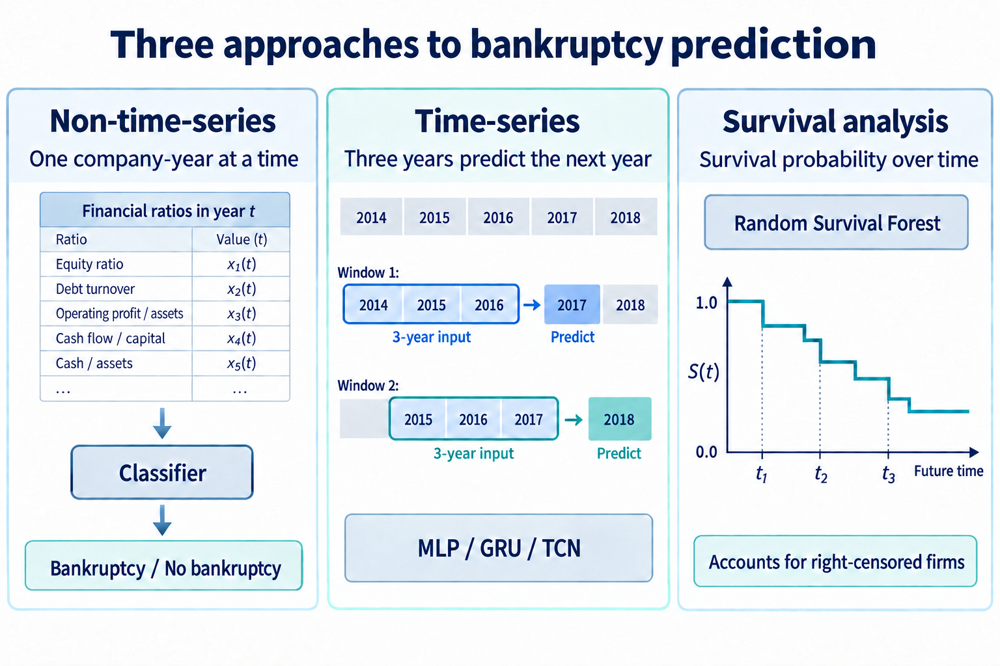
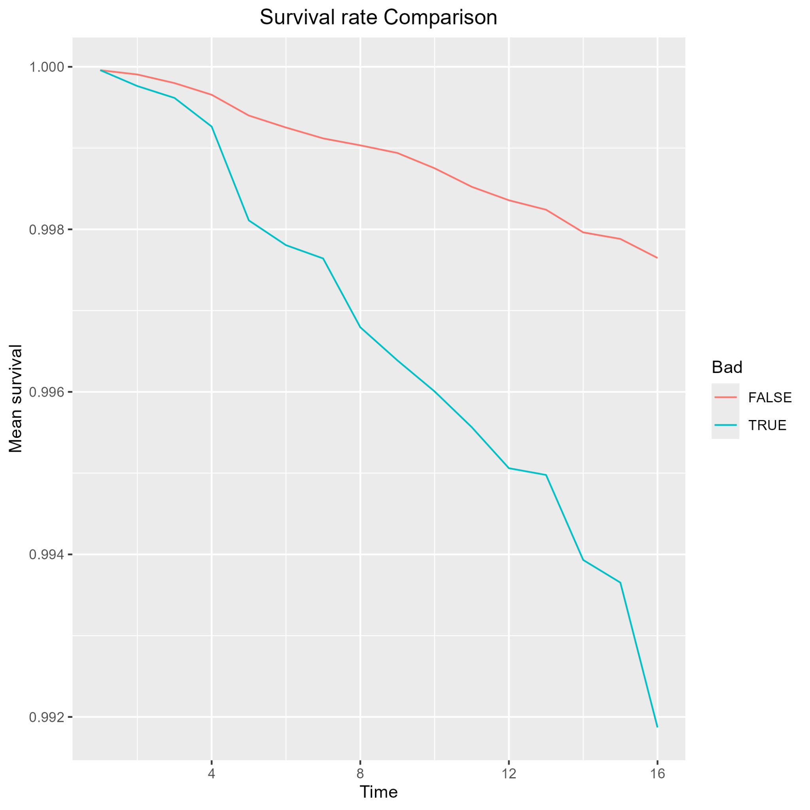
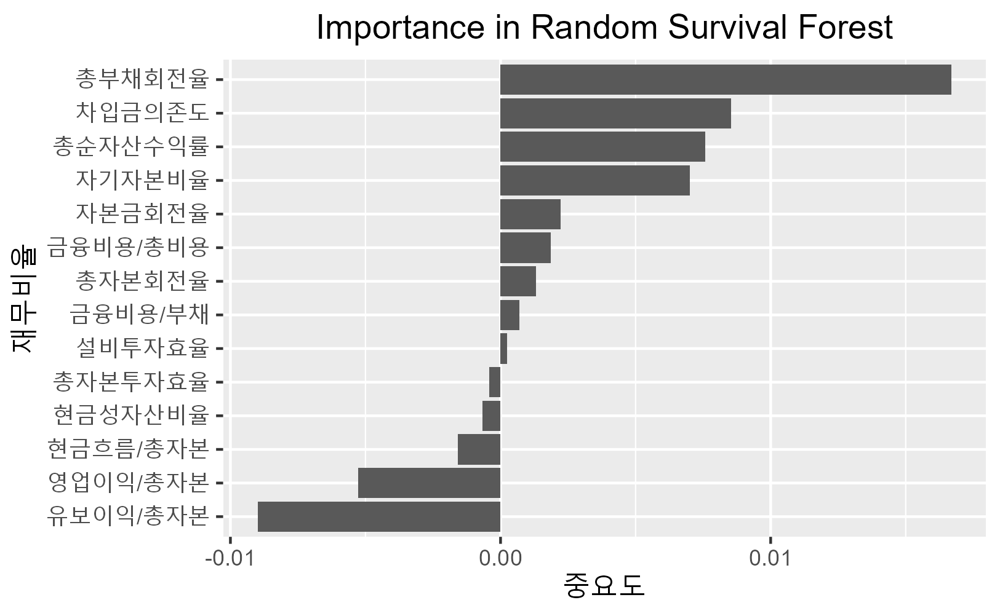

# Bankruptcy Prediction for Korean Companies Using Financial Information

*재무정보를 활용한 한국 기업의 부도예측*

**Seoul National University · Data Mining Methods and Lab · Spring 2025**  
Four-person team project · Instructor: Prof. Yongdai Kim

**My role (Jeong-Ho SEO):** **Non-time-series and time-series** classification, including preprocessing experiments, sampling, model comparison, ensembles, and Random Forest feature importance. Other team members contributed *survival analysis* and broader feature analysis.

## 1. Motivation

Financial statements are recorded repeatedly over time, making changes in a company's financial condition a natural subject for time-series analysis. This motivated me to compare a non-time-series baseline with models using several years of financial history. The dataset used here contains **annual observations**, rather than quarterly observations.

A company that has not failed by the end of observation may still fail later. To address this censoring problem, another team member explored survival analysis. Alongside prediction, we examined **which financial variables matter**, using Random Forest and Random Survival Forest importance and regularized logistic regression.

## 2. Methodology

### Data

Combined DataGuide financial statements with KIND delisting dates and reasons for Korean listed companies, **1999–2024**. The target, `Bad`, identifies bankruptcy/default-related delisting events rather than all delistings. The final dataset contains **96,161 company-year records from 5,603 companies**, including 70 positive records.

### A. Predictive Modeling

**Non-time-series classification — my implementation**

1. Represent each company-year using **14 financial ratios**, covering profitability, leverage, cash flow, and turnover. Compare the full set with a 13-feature set after removing a highly correlated variable (`|r| > 0.8`).
2. Match each positive record with five control records from the same year, producing **420 records**. Split companies into 70% training/validation and 30% test groups.
3. Train Random Forest, AdaBoost, and MLP. Use five-fold stratified validation within the training group to select each model, then average their predicted probabilities for a **soft voting ensemble**.

**Time-series classification — my implementation**

1. Sort each company's records by year and construct **three-year sliding windows**. Require the three input years and the target year to be consecutive; discard windows with gaps.
2. Use years `t−3, t−2, t−1` to predict `Bad` in year `t`. For example, **2014–2016 financial history predicts the 2017 label**. The final code uses a `3 × 14` input: three years, each containing the accounting year and 13 financial ratios.
3. Compare an **MLP** that flattens the window, a **GRU** that processes the sequence, and a **TCN** with dilated temporal convolutions.
4. Sort windows by prediction year. Use **2002–2016** for model development with `TimeSeriesSplit`, and reserve **2017–2024** for testing. The resulting 79,390 windows include only 58 positive labels.
5. Train with weighted binary cross-entropy, using the negative-to-positive ratio in each training fold as the positive-class weight. Compare individual models, equal-weight soft voting, and voting weighted by validation AUC.

**Survival analysis — team contribution**

Use **Random Survival Forest (RSF)** to estimate survival over time while accounting for companies whose failure has not been observed. Compare survival curves between event and non-event groups, then examine the relationship between estimated survival probabilities and credit ratings.

### B. Feature Importance and Selection

- **My analysis:** Compare Random Forest feature importance across the full and reduced ratio sets. Examine how correlated predictors redistribute importance without necessarily improving prediction.
- **Team analysis:** Use RSF permutation importance to examine predictors of survival. Apply **Lasso and Ridge logistic regression** to a broader financial-variable set to assess variable selection and coefficient shrinkage. This analysis uses one selected record per company, a balanced 70:70 sample, and a 70:30 train/test split.

**Tools (Python):** pandas, NumPy, scikit-learn, PyTorch and Matplotlib.

## 3. Results

### My Classification Results

**Non-time-series models:** held-out company results from the final notebook. Each entry shows **accuracy / ROC AUC**.

| Model | Full features (14) | Reduced features (13) |
| --- | ---: | ---: |
| Random Forest | 91.60% / 0.8851 | 87.79% / 0.8828 |
| AdaBoost | 88.55% / 0.7763 | 83.97% / 0.7982 |
| MLP | 87.79% / 0.8322 | 90.84% / 0.8144 |
| Soft Voting Ensemble | 90.84% / 0.9008 | **92.37% / 0.9112** |

**Time-series models:** results on 28,515 test windows, including only 10 positive labels.

| Model | Test Accuracy | Test ROC AUC |
| --- | ---: | ---: |
| MLP | 99.42% | **0.7553** |
| GRU | 99.94% | 0.4985 |
| TCN | 99.96% | 0.7446 |
| Soft Voting Ensemble | 99.96% | 0.7526 |
| Weighted Voting Ensemble | 99.95% | 0.7527 |

The reduced-feature ensemble performed best in the non-time-series experiment. MLP achieved the highest time-series AUC; ensembling did not improve on it. GRU's near-perfect accuracy but near-random AUC illustrates the effect of severe class imbalance.

### Team Survival and Feature Analysis Results

| Analysis | Finding reported in the final presentation |
| --- | --- |
| RSF survival curves | Companies with bankruptcy/default events had lower mean estimated survival, with a widening gap over time; the absolute gap remained small. |
| RSF importance | Total debt turnover ranked highest, followed by borrowing dependence, `총순자산수익률`, and equity ratio. Rankings differed from those of the classification Random Forest. |
| Lasso logistic regression | Reported ROC AUC **0.914** and excluded several financial variables, including total assets, current assets, and interest expense. |
| Ridge logistic regression | Reported ROC AUC **0.887**. |
| Credit-rating analysis | Higher estimated survival was associated with higher numerical ratings in analyses covering 522 companies with commercial-paper ratings and 808 with corporate-bond ratings. |

  

  

*Original figures extracted from slide 22 of the final team presentation.*

## Project Files

- Team presentation: [PDF](Final_presentation/Final_team_01.pdf) · [PPTX](Final_presentation/Final_team_01.pptx).
- [My final notebook](Final_4/Final_Models_jeongho.ipynb): final classification experiments and recorded results.
- [My analysis notes](docs/MY_ANALYSIS.md): all seven notebooks, development history, exact implementation details, and qualifications.
- [Data folder](https://drive.google.com/drive/folders/1xg4F7QOyplY8FjgkEeuGWM3J5HGByMeh?usp=sharing)
